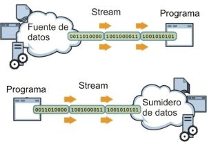

# Entrada / Salida 
## E/S con flujos (streams)
- El sistema de entrada/salida en Java. Usa la abstracción del flujo (stream) para tratar la comunicación de información entre el programa y el exterior (teclado, pantalla, archivos, sockets de red, e incluso con otro programa. Cualquier programa que tenga que obtener información de cualquier fuente necesita abrir un stream, igualmente si necesita enviar información abrirá un stream.

- Los flujos son secuencias ordenadas de datos que tienen una fuente (flujos de entrada) o un destino (flujos de salida).



A continucaion mostramos un ejemplo basico de manejo de archivos. En este caso vamos a leer de un arhcivo con el nombre "uno.in" que contiene numeros, los cargamos en memoria  luego trabjamos con esos numeros(elevamos al cuadrado) y guardamos los resultados en otro archivo llamado "uno.out".

### Creacion de Clase Archivo

Creamos la clase `Archivo` que tiene un atributo de tipo `String`.

```java
public class Archivo {
	private String nombre;
	public Archivo(String nombre) { //Constructor
		this.nombre = nombre;
	}
```
***
### ¿Como leer un archivo?
Es importante saber el formato de entrada que recibimos, en esta caso tenemos una entrada con el siguiente formato.
- La primera linea indica la cantidad de numeros que contiene.
- La segunda linea los numeros separados por espacios en blancos.

uno.in
```
5
2.2 4.4 8.8 16.16 30
```
#### Metodo leerArchivo
- El metodo nos devuelve un array del tipo de dato `double`.

- Utlizamos la clase [`Scanner`](https://docs.oracle.com/javase/7/docs/api/java/util/Scanner.html) que viene en el paquete java.util utilizada para obtener la entrada de los tipos primitivos como int, double, etc. y también String.

- Para crear un objeto de clase Scanner, normalmente pasamos el objeto predefinido System.in, que representa el flujo de entrada estándar. Pero podemos pasar un objeto de clase [`File`](https://docs.oracle.com/javase/7/docs/api/java/io/File.html) si queremos leer la entrada de un archivo.

```java
public double[] leerArchivo() {
	Scanner arch = null;
	double[] datos = null;
	try {
		arch = new Scanner(new File("casos de prueba/in/" + this.nombre + ".in"));
		arch.useLocale(Locale.ENGLISH);//especifica la configuración regional que se va a utilizar
		int cant = arch.nextInt();
		datos = new double[cant];
		for (int i = 0; i < cant; i++) {
			double n = arch.nextDouble();
			datos[i] = n;
		}
	} catch (Exception e) {
		e.printStackTrace();
	} finally {
		arch.close();//Cerrar el archivo ,eso es mucho muy importante.
	}
	return datos;
}
```
***
### ¿Como guardar un archivo?
- Uilizamos la clase [`FileWriter`](https://docs.oracle.com/javase/7/docs/api/java/io/FileWriter.html) que nos permite realizar escrituras de caracteres de texto sobre un archivo.
- La clase [`PrintWriter`](https://docs.oracle.com/javase/7/docs/api/java/io/PrintWriter.html) soporta diferentes tipos de datos para imprimir desde los mas primitivos como números, texto hasta arrays y objetos.

```java
public void guardarArchivo(double[] datos) {
		FileWriter archivo = null;
		PrintWriter pw = null;
		try {
			archivo = new FileWriter("casos de prueba/out/" + this.nombre + ".out");
			pw = new PrintWriter(archivo);
			for(int i = 0; i < datos.length; i++) {
				pw.println(datos[i]); //Imprime los datos y hace un salto de linea.
			}
		} catch (Exception e) {
			e.printStackTrace();
		} finally {
			if (archivo != null) {
				try {
					archivo.close();
				} catch (IOException e) {
					e.printStackTrace();
				}
			}
		}
	}
```
***
### Probamos el codigo

Ahora solo nos queda probar el codigo.

```java
public class Main {
	public static void main(String[] args) {
		Archivo archivo = new Archivo("uno");
		double[] datos = archivo.leerArchivo();
		// Elevo al cuadrado
		for(int i = 0; i < datos.length; i++) {
			datos[i] = (double)Math.round(datos[i] * datos[i] * 10000d) / 10000d;
		}
		archivo.guardarArchivo(datos);
	}
}
```

Resultado esperado

uno.out
```
4.84
19.36
77.44
261.1456
900.0
```
